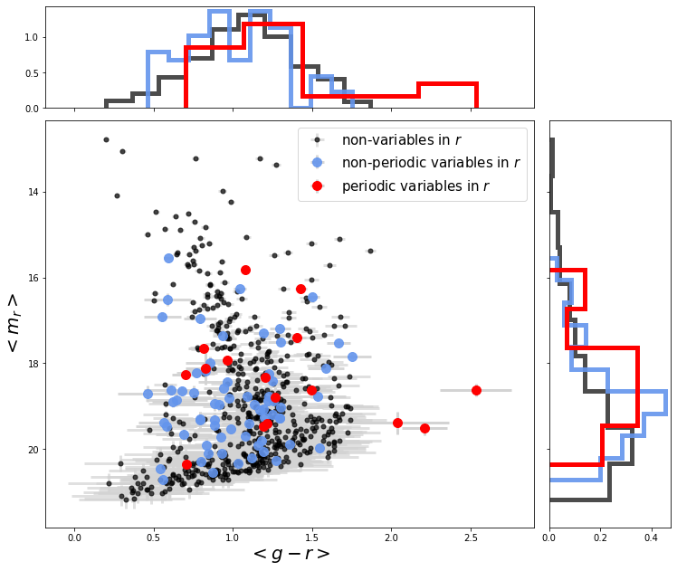
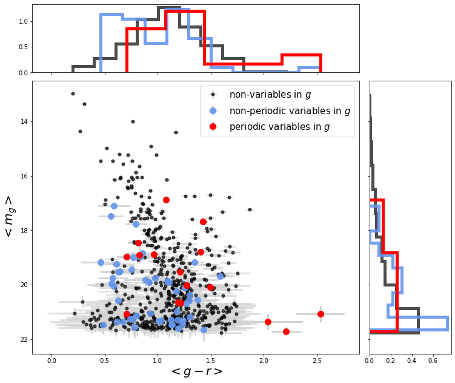
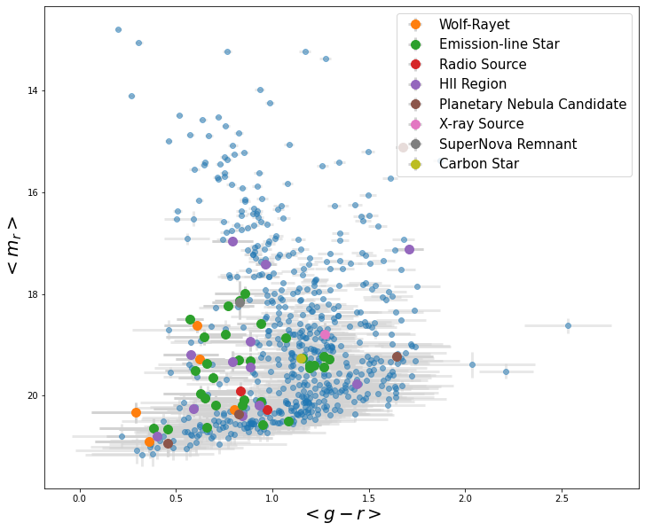
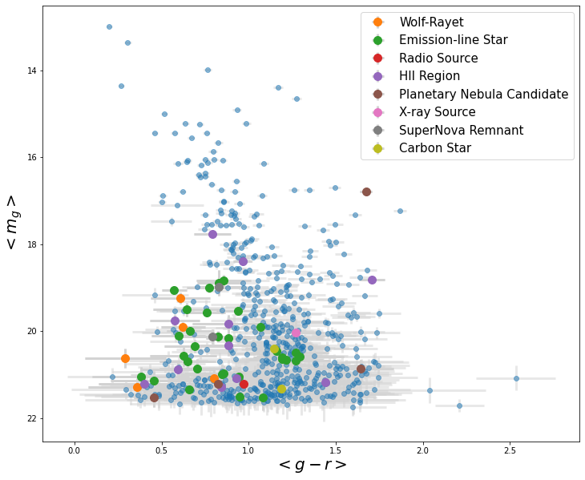
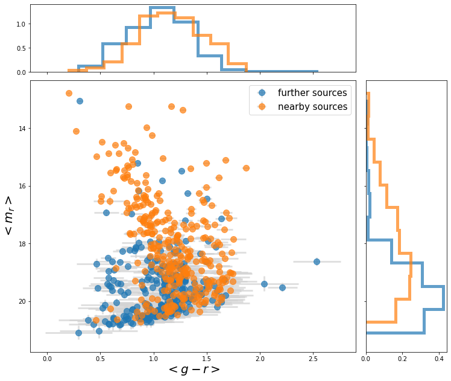
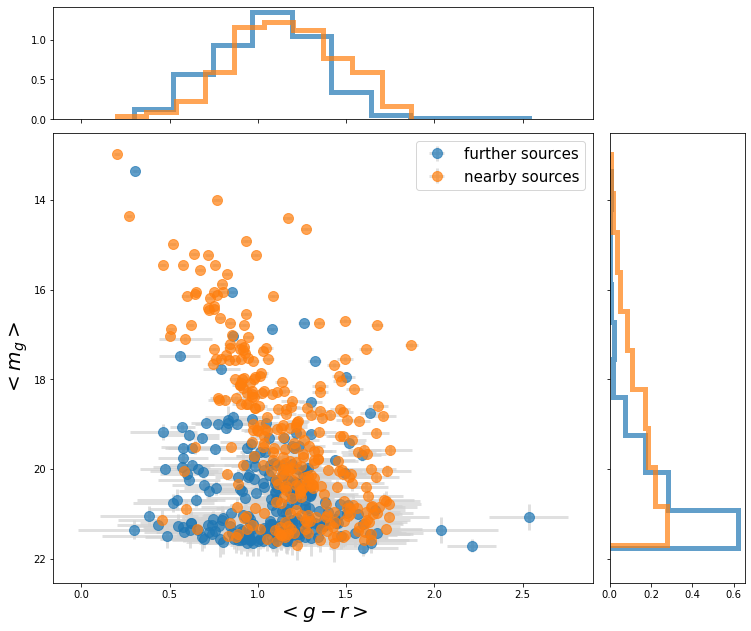
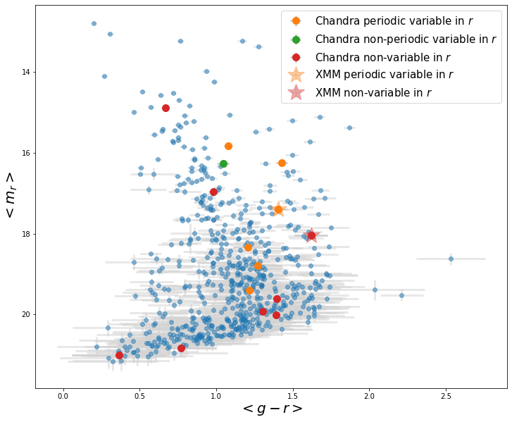
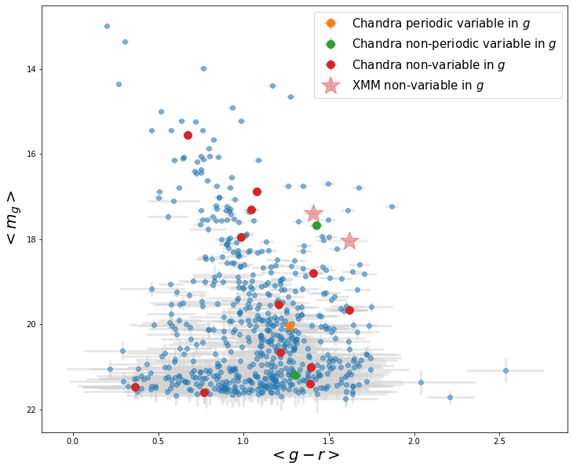
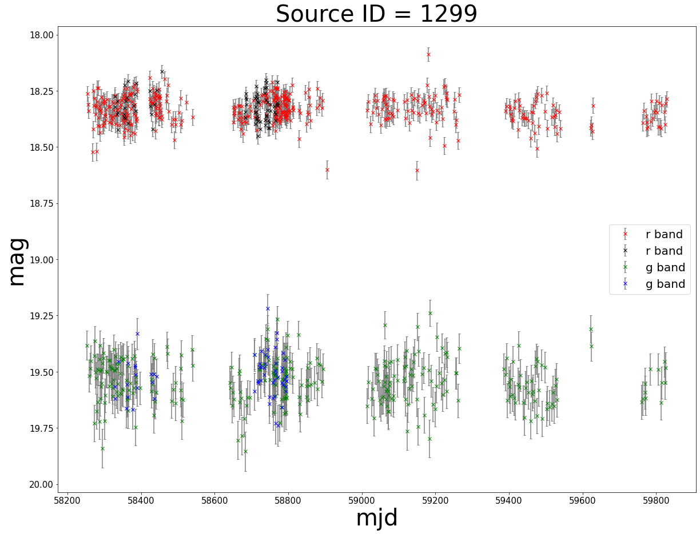
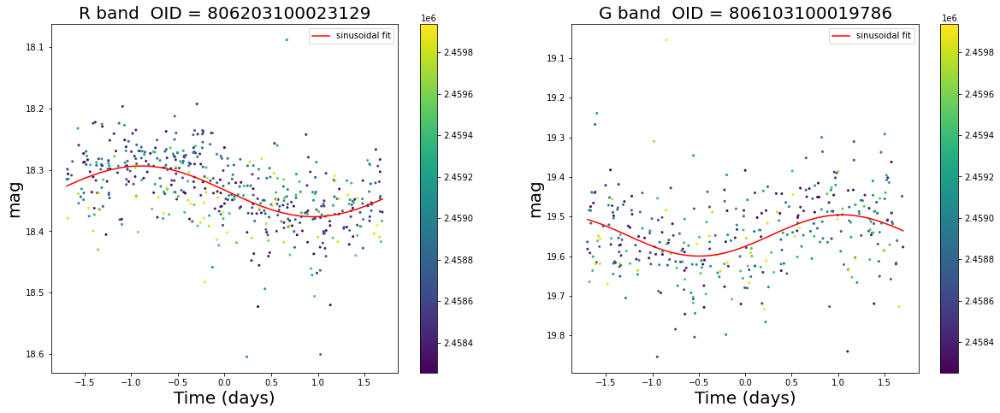

# Transients-in-IC-10

[Paper in prep](https://www.overleaf.com/read/rdvxqytkfhww)

## ZTF IC 10 variable catalog
[ZTF $r$ band](t_zr_0307.ecsv)
[ZTF $g$ band](t_zg_0307.ecsv)

## Non-variables, non-periodic variables, and periodic variables classified by this work

## Cross match with SIMBAD

## Whether the source is nearby (in front of IC 10), or further way (likely inside IC 10)

## Cross match with X-ray catalogs

## Interesting lightcurves

