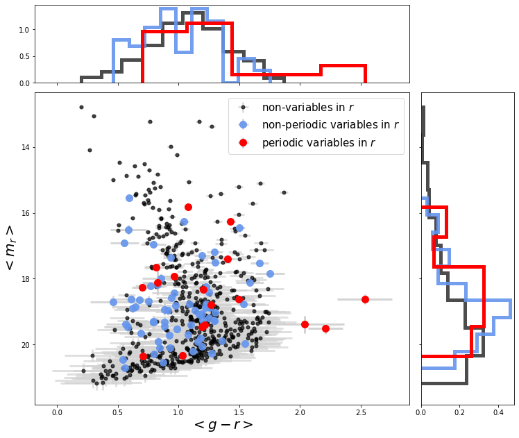
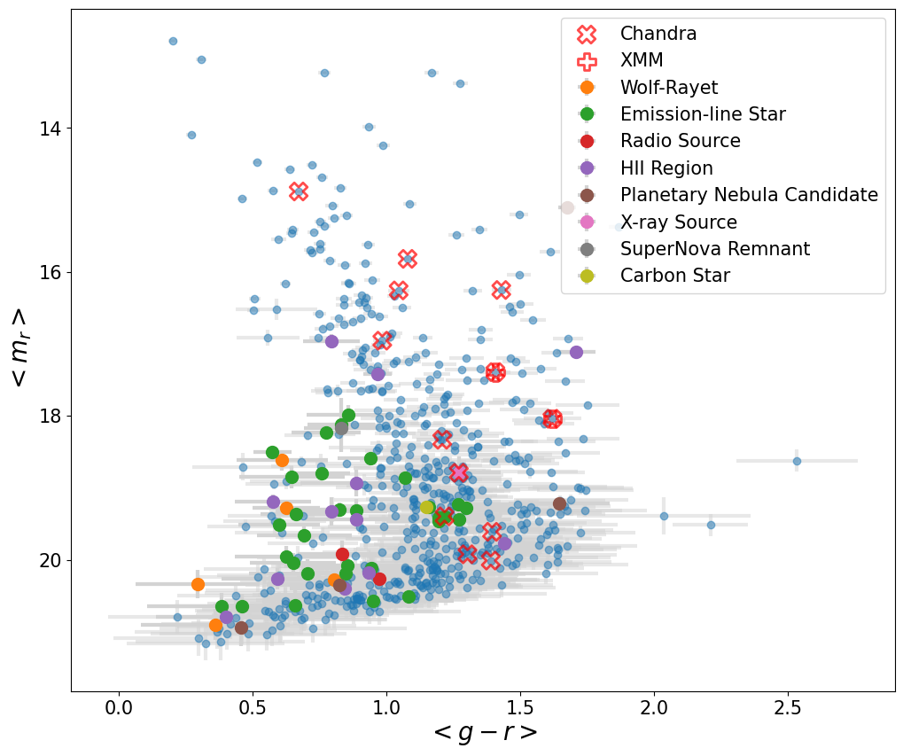
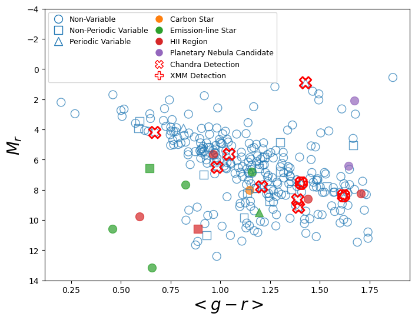
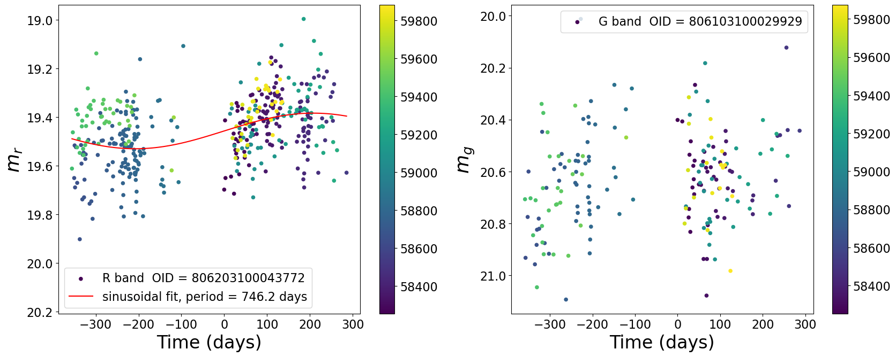

# Transients-in-IC-10
### [1. ZTF IC 10 variable catalog (Main product)](#1-ztf-ic-10-variable-catalog-main-product-1)
### [2. Cite this work](#2-Cite-this-work-1)
### [3. Non-variables, non-periodic variables, and periodic variables identified by this work](#3-Non-variables-non-periodic-variables-and-periodic-variables-identified-by-this-work-1)
### [4. Cross match with SIMBAD，X-ray and Gaia](#4-cross-match-with-simbadx-ray-and-gaia-1)
### [5. HR diagrams](#5-HR-diagrams-1)
### [6. Interesting lightcurves](#6-Interesting-lightcurves-1)

## 1. ZTF IC 10 variable catalog (Main product)
- ZTF r band catalog: [csv](df_zr.csv) / [ecsv (astropy Qtable)](t_zr_20240401.ecsv)
- ZTF g band catalog: [csv](df_zg.csv)  / [ecsv (astropy Qtable)](t_zg_20240401.ecsv)
- color catalog: [csv](df_color.csv) / [ecsv (astropy Qtable)](t_color_0912.ecsv)

## 2. Cite this work
If you use this repository or would like to refer the paper, please use the following BibTeX entry:

    @article{
    }

## 3. Non-variables, non-periodic variables, and periodic variables identified by this work
  

## 4. Cross match with SIMBAD，X-ray and Gaia
  

## 5. HR diagrams
 

## 6. Interesting lightcurves
### 6.1. Flaring Super Giants
 

### 6.2. Luminous Blue Variable (LBV) with Long Secondary Period (LSP)

### 6.3. Periodic Super Giants
  
 

### 6.4. Luminous Blue Variable (LBV) Candidate
 

### 6.5. Mira Candidates
  

### 6.6. Possible Periodic Subdwarf
 

### 6.7. Low Mass X-ray Binary in the Milky Way
 
